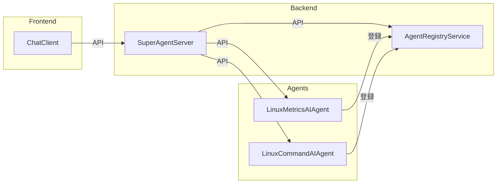
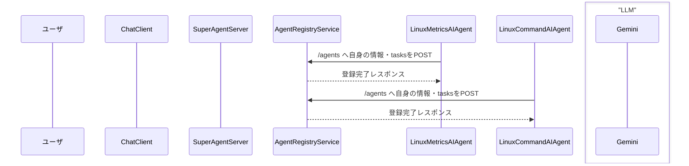
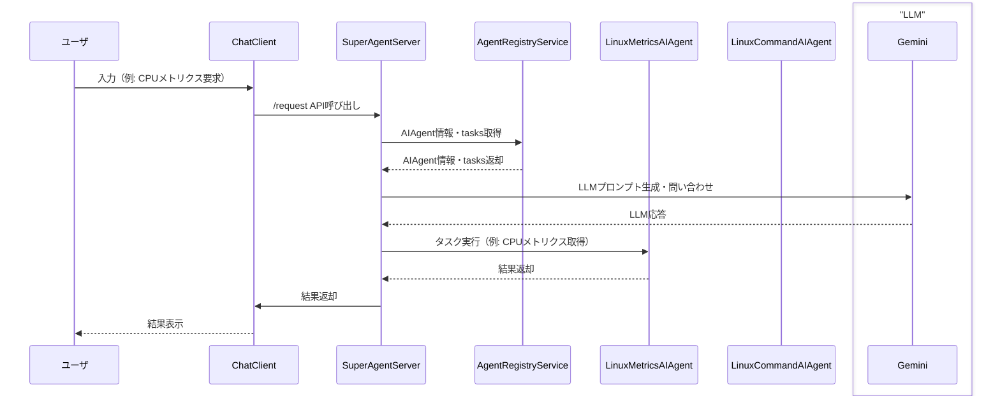

# AI Agent System (SuperAgentServer, AgentRegistryService, LinuxMetricsAIAgent, LinuxCommandAIAgent)

## 概要
このプロジェクトは、複数のAIエージェント（AIAgent）を統合し、ユーザ要求に応じて最適なタスク実行・情報取得を行うシステムです。

- **ChatClient**: ユーザインターフェース（React+Vite）
- **SuperAgentServer**: ユーザ要求を受け、AIAgentやLLMと連携して実行計画を立案・実行するメインサーバ
- **AgentRegistryService**: AIAgentの登録・管理・情報提供を行うレジストリサーバ
- **LinuxMetricsAIAgent**: Linuxメトリクス取得用AIAgent
- **LinuxCommandAIAgent**: Linuxコマンド実行用AIAgent

---

## システム構成

### プロセス構成図



### 起動編：AIAgentの登録・準備完了まで

AIAgentは起動時にAgentRegistryServiceへ自身の情報（tasks含む）を登録し、準備完了となります。



### 利用編：ユーザ要求から結果返却まで

ユーザがChatClientを通じてリクエストを送信し、SuperAgentServerがAIAgentやRegistry、LLM（Gemini）と連携して結果を返却します。



## API設計（主要エンドポイント）
### SuperAgentServer
- `/request` : ユーザ要求を受けて実行計画を立案・実行
    - 入力: `{ "user_input": "..." }`
    - 出力: `{ "status": ..., "result": ... }`
    
    #### リクエスト例
    ```json
    POST /request
    {
      "user_input": "CPUメトリクスを教えて"
    }
    ```
    #### レスポンス例
    ```json
    {
      "status": "success",
      "result": {
        "cpu_usage": 12.3,
        "unit": "%"
      }
    }
    ```
- `/command` : システムコマンド実行
    - 入力: `{ "command": "...", "arguments": [ ... ] }`
    - 出力: `{ "command": ..., "status": ..., "result": ... }`
    
    #### リクエスト例
    ```json
    POST /command
    {
      "command": "ls",
      "arguments": ["-l", "/tmp"]
    }
    ```
    #### レスポンス例
    ```json
    {
      "command": "ls",
      "status": "SUCCESS",
      "result": ["file1.txt", "file2.txt"]
    }
    ```

> ※ `/agents` `/tasks` などのAPIは廃止。AIAgent情報・tasksは全てRegistry経由で取得。

### AgentRegistryService
- `/agents` : AIAgentの登録・一覧・詳細取得
    - POST: 新規登録/上書き（tasks含む全情報をJSONで）
    - GET: 一覧取得（tasks含む）
    - GET `/agents/{artifactID}`: 個別取得

---

## tasks情報の流れ
- 各AIAgentは `/tasks` API（またはget_registry_info）で自分のタスク一覧（`requires_consent`含む）を返す
- 登録時にtasks情報を含めてRegistryへPOST
- Registryはtasks情報をJSONで保存・返却
- SuperAgentServerはRegistryからtasks情報を取得し、ユーザ要求に応じて実行計画を生成

---

## Docker運用
- `docker-compose build` で全サービスのイメージをビルド
- `docker-compose up -d` で全サービス起動
- ボリューム（`volumes/agent_registry_service:/work`）でRegistryの永続化
- キャッシュ/中間ファイルは `.gitignore` で管理外
- サービス再起動時は `docker-compose down && docker-compose up -d` で反映

---

## .env 設定例
```
VITE_SUPER_AGENT_API=http://super_agent_server:5001
GEMINI_API_KEY=...（省略）
GEMINI_MODEL=models/gemini-2.5-flash
AGENT_REGISTRY_URL=http://agent_registry_service:5002
DOMAIN_NAME=edo.marble-corp.com
```
- `AGENT_REGISTRY_URL` は `/agents` を含めず指定
- 各AIAgentは `ARTIFACT_ID` を `DOMAIN_NAME/service名` で自動生成

---

## ディレクトリ構成
```
<project-root>
  docker-compose.yml
  .env
  src/
    chat_client/
    super_agent_server/
    agent_registry_service/
    linux_metrics_ai_agent/
    linux_command_ai_agent/
```

---

## クイックスタート
1. リポジトリをクローン
2. `.env` を編集
3. `docker-compose build` で全サービスビルド
4. `docker-compose up -d` で全サービス起動
5. ChatClient（Web UI）から操作

---

## 備考・今後のTODO
- README.mdを実装に合わせて随時更新
- ChatClientやAPI呼び出し例の追記
- LLMプロンプト設計・同意フローのUI連携強化

---

## テストディレクトリ構成・実行方法
- `test/unit/` : APIやロジックのユニットテスト（pytest等で実行）
- `test/e2e/` : ChatClientを含むE2Eテスト（Node.js Playwright公式ランナー＋Docker完全自己完結型）

### E2Eテスト実行例
```sh
cd test/e2e
./build.sh   # Dockerイメージをビルド（初回またはテストコード変更時）
./run.sh     # E2Eテストを実行
```
- 依存解決・テスト実行はすべてDockerコンテナ内で完結します
- Python+Playwrightによる旧E2Eテストは廃止しました

---

## ChatClientからのAPI呼び出し例
```js
// 例: fetchでSuperAgentServerの/requestを呼ぶ
fetch(process.env.VITE_SUPER_AGENT_API + '/request', {
  method: 'POST',
  headers: { 'Content-Type': 'application/json' },
  body: JSON.stringify({ user_input: 'CPUメトリクスを教えて' })
})
  .then(res => res.json())
  .then(data => console.log(data));
```

---

## .envの配置と用途
- ルート直下: バックエンド各サービス用（APIエンドポイント、LLMキー等）
- `src/chat_client/.env`: フロントエンド用（VITE_SUPER_AGENT_API など）

---

## 運用Tips
- Docker再起動時は `docker-compose down && docker-compose up -d` で全サービスを再起動
- Registryの永続化は `volumes/agent_registry_service:/work` で管理
- キャッシュ/中間ファイルは `.gitignore` で除外
- テスト用APIやE2Eテストは本番環境では無効化・制限推奨

---

## 今後のTODO
- [ ] README.mdのAPI例・テスト運用説明の充実
- [ ] ChatClientやAPI呼び出し例の拡充
- [ ] LLMプロンプト設計・同意フローのUI連携強化
- [ ] テストケースの追加・自動化